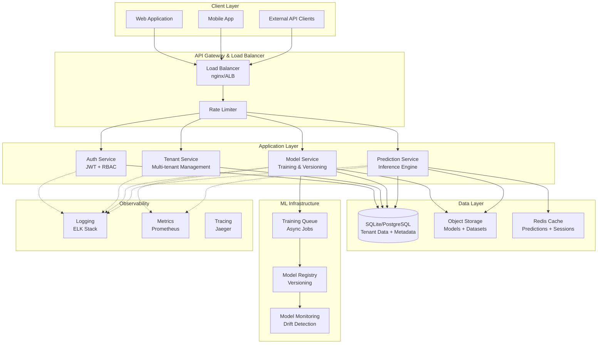
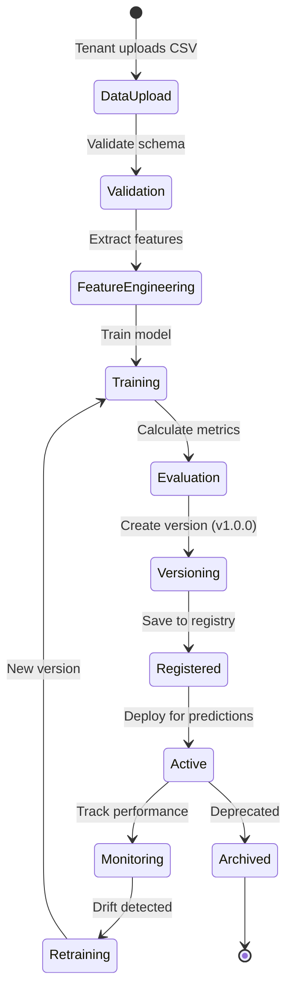
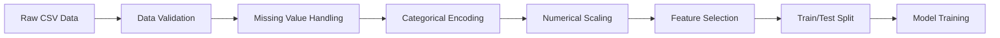
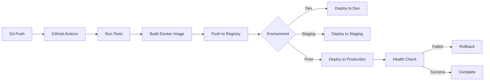

# Multi-Tenant AI SaaS Platform - Architecture Documentation

## 1. Executive Summary

Bu doküman, birden fazla AI çözümünü tek bir SaaS platformu altında toplayan enterprise-grade multi-tenant AI platformunun teknik mimarisini detaylandırmaktadır.

**Temel Özellikler:**
- Multi-tenant izolasyon (tenant bazlı veri ayrımı)
- Self-service ML model eğitimi ve versiyonlama
- REST API üzerinden prediction servisi
- Role-based access control (RBAC)
- Production-ready deployment stratejisi

---

## 2. High-Level Architecture



---

## 3. Service Decomposition

### 3.1 API Gateway
**Sorumluluklar:**
- Request routing
- SSL termination
- Rate limiting (tenant bazlı)
- CORS handling

**Teknoloji:** nginx / AWS ALB / Kong

### 3.2 Authentication Service
**Sorumluluklar:**
- Kullanıcı kaydı ve login
- JWT token üretimi ve validasyonu
- Password hashing (bcrypt)
- Role-based access control

**Endpoints:**
- `POST /api/v1/auth/register`
- `POST /api/v1/auth/login`
- `POST /api/v1/auth/refresh`
- `GET /api/v1/auth/me`

### 3.3 Tenant Service
**Sorumluluklar:**
- Tenant oluşturma ve yönetimi
- Tenant metadata yönetimi
- Kullanıcı-tenant ilişkilendirmesi
- Tenant bazlı izolasyon kontrolü

**Endpoints:**
- `POST /api/v1/tenants` (Admin only)
- `GET /api/v1/tenants/{tenant_id}`
- `PUT /api/v1/tenants/{tenant_id}`
- `GET /api/v1/tenants/{tenant_id}/users`

### 3.4 Model Service
**Sorumluluklar:**
- Veri yükleme ve validasyonu
- Feature engineering
- Model eğitimi (async)
- Model versiyonlama
- Model metadata yönetimi

**Endpoints:**
- `POST /api/v1/models/upload-data`
- `POST /api/v1/models/train`
- `GET /api/v1/models`
- `GET /api/v1/models/{model_id}`
- `GET /api/v1/models/{model_id}/versions`

### 3.5 Prediction Service
**Sorumluluklar:**
- Model yükleme ve caching
- Real-time prediction
- Input validation
- Response formatting

**Endpoints:**
- `POST /api/v1/predict`
- `POST /api/v1/predict/batch`

---

## 4. Multi-Tenant İzolasyon Stratejisi

### 4.1 Seçilen Yaklaşım: Shared Database with Tenant ID

**Mimari:**
```
┌─────────────────────────────────────────┐
│         Application Layer               │
│  (Tenant Context Middleware)            │
└─────────────────────────────────────────┘
                    │
                    ▼
┌─────────────────────────────────────────┐
│         SQLite Database                 │
│                                         │
│  ┌──────────────────────────────────┐  │
│  │ tenants                          │  │
│  │ - id (PK)                        │  │
│  │ - name                           │  │
│  │ - created_at                     │  │
│  └──────────────────────────────────┘  │
│                                         │
│  ┌──────────────────────────────────┐  │
│  │ users                            │  │
│  │ - id (PK)                        │  │
│  │ - tenant_id (FK) ◄───────────────┼──┤
│  │ - email                          │  │
│  │ - role (Admin/User)              │  │
│  └──────────────────────────────────┘  │
│                                         │
│  ┌──────────────────────────────────┐  │
│  │ ml_models                        │  │
│  │ - id (PK)                        │  │
│  │ - tenant_id (FK) ◄───────────────┼──┤
│  │ - name, version                  │  │
│  │ - model_path                     │  │
│  └──────────────────────────────────┘  │
│                                         │
│  ┌──────────────────────────────────┐  │
│  │ datasets                         │  │
│  │ - id (PK)                        │  │
│  │ - tenant_id (FK) ◄───────────────┼──┤
│  │ - file_path                      │  │
│  └──────────────────────────────────┘  │
└─────────────────────────────────────────┘
```

**Avantajlar:**
- ✅ Maliyet etkin (tek database instance)
- ✅ Kolay yedekleme ve bakım
- ✅ Basit deployment
- ✅ Resource sharing ile daha iyi kaynak kullanımı

**Dezavantajlar:**
- ⚠️ Dikkatli query yazımı gerektirir (tenant_id filtresi)
- ⚠️ Bir tenant'ın yoğun kullanımı diğerlerini etkileyebilir
- ⚠️ Regulatory compliance bazı durumlarda fiziksel izolasyon gerektirebilir

**Güvenlik Önlemleri:**
```python
# Her query'de otomatik tenant_id filtresi
class TenantMiddleware:
    async def __call__(self, request: Request):
        tenant_id = extract_tenant_from_token(request)
        request.state.tenant_id = tenant_id
        
# ORM seviyesinde zorunlu filtreleme
def get_models(db: Session, tenant_id: int):
    return db.query(MLModel).filter(
        MLModel.tenant_id == tenant_id
    ).all()
```

### 4.2 Alternatif Yaklaşımlar (Değerlendirildi)

**Database per Tenant:**
- Her tenant için ayrı database
- Maksimum izolasyon
- Yüksek operasyonel maliyet
- 100+ tenant için yönetimi zor

**Schema per Tenant:**
- PostgreSQL schema'ları kullanarak izolasyon
- Orta seviye izolasyon
- SQLite desteklemiyor

---

## 5. Model Lifecycle Management



### 5.1 Model Versioning

**Semantic Versioning:**
- `v1.0.0`: İlk production model
- `v1.1.0`: Aynı veri, farklı hyperparameter
- `v2.0.0`: Farklı veri veya algoritma

**Metadata Tracking:**
```python
{
    "model_id": "uuid",
    "tenant_id": 123,
    "version": "v1.2.0",
    "algorithm": "RandomForestClassifier",
    "training_date": "2026-02-17T14:30:00Z",
    "metrics": {
        "accuracy": 0.92,
        "f1_score": 0.89,
        "precision": 0.91,
        "recall": 0.87
    },
    "hyperparameters": {
        "n_estimators": 100,
        "max_depth": 10
    },
    "training_samples": 5000,
    "feature_count": 15,
    "status": "active"
}
```

### 5.2 Model Storage

**Dosya Yapısı:**
```
models/
├── tenant_123/
│   ├── model_abc/
│   │   ├── v1.0.0/
│   │   │   ├── model.pkl
│   │   │   ├── scaler.pkl
│   │   │   └── metadata.json
│   │   ├── v1.1.0/
│   │   │   ├── model.pkl
│   │   │   ├── scaler.pkl
│   │   │   └── metadata.json
```

---

## 6. Data Storage Architecture

### 6.1 Database Schema (SQLite)

```sql
-- Tenants
CREATE TABLE tenants (
    id INTEGER PRIMARY KEY AUTOINCREMENT,
    name VARCHAR(255) NOT NULL UNIQUE,
    api_key VARCHAR(255) UNIQUE,
    status VARCHAR(50) DEFAULT 'active',
    created_at TIMESTAMP DEFAULT CURRENT_TIMESTAMP,
    updated_at TIMESTAMP DEFAULT CURRENT_TIMESTAMP
);

-- Users
CREATE TABLE users (
    id INTEGER PRIMARY KEY AUTOINCREMENT,
    tenant_id INTEGER NOT NULL,
    email VARCHAR(255) NOT NULL UNIQUE,
    hashed_password VARCHAR(255) NOT NULL,
    full_name VARCHAR(255),
    role VARCHAR(50) NOT NULL, -- 'admin', 'user', 'viewer'
    is_active BOOLEAN DEFAULT 1,
    created_at TIMESTAMP DEFAULT CURRENT_TIMESTAMP,
    FOREIGN KEY (tenant_id) REFERENCES tenants(id)
);

-- Datasets
CREATE TABLE datasets (
    id INTEGER PRIMARY KEY AUTOINCREMENT,
    tenant_id INTEGER NOT NULL,
    name VARCHAR(255) NOT NULL,
    file_path VARCHAR(500) NOT NULL,
    row_count INTEGER,
    column_count INTEGER,
    uploaded_by INTEGER,
    created_at TIMESTAMP DEFAULT CURRENT_TIMESTAMP,
    FOREIGN KEY (tenant_id) REFERENCES tenants(id),
    FOREIGN KEY (uploaded_by) REFERENCES users(id)
);

-- ML Models
CREATE TABLE ml_models (
    id INTEGER PRIMARY KEY AUTOINCREMENT,
    tenant_id INTEGER NOT NULL,
    name VARCHAR(255) NOT NULL,
    version VARCHAR(50) NOT NULL,
    algorithm VARCHAR(100),
    model_path VARCHAR(500) NOT NULL,
    dataset_id INTEGER,
    accuracy REAL,
    f1_score REAL,
    precision_score REAL,
    recall_score REAL,
    status VARCHAR(50) DEFAULT 'training', -- 'training', 'active', 'archived'
    created_by INTEGER,
    created_at TIMESTAMP DEFAULT CURRENT_TIMESTAMP,
    FOREIGN KEY (tenant_id) REFERENCES tenants(id),
    FOREIGN KEY (dataset_id) REFERENCES datasets(id),
    FOREIGN KEY (created_by) REFERENCES users(id),
    UNIQUE(tenant_id, name, version)
);

-- Predictions (for audit trail)
CREATE TABLE predictions (
    id INTEGER PRIMARY KEY AUTOINCREMENT,
    tenant_id INTEGER NOT NULL,
    model_id INTEGER NOT NULL,
    input_data TEXT, -- JSON
    prediction TEXT, -- JSON
    confidence REAL,
    created_at TIMESTAMP DEFAULT CURRENT_TIMESTAMP,
    FOREIGN KEY (tenant_id) REFERENCES tenants(id),
    FOREIGN KEY (model_id) REFERENCES ml_models(id)
);

-- Indexes for performance
CREATE INDEX idx_users_tenant ON users(tenant_id);
CREATE INDEX idx_datasets_tenant ON datasets(tenant_id);
CREATE INDEX idx_models_tenant ON ml_models(tenant_id);
CREATE INDEX idx_predictions_tenant ON predictions(tenant_id);
CREATE INDEX idx_predictions_model ON predictions(model_id);
```

### 6.2 File Storage

**Prototip:** Local filesystem
**Production:** S3 / Azure Blob / GCS

---

## 7. Feature Engineering Pipeline



**Otomatik Feature Engineering:**
```python
class FeatureEngineer:
    def process(self, df):
        # 1. Detect column types
        numeric_cols = df.select_dtypes(include=['number']).columns
        categorical_cols = df.select_dtypes(include=['object']).columns
        
        # 2. Handle missing values
        df[numeric_cols] = df[numeric_cols].fillna(df[numeric_cols].median())
        df[categorical_cols] = df[categorical_cols].fillna('MISSING')
        
        # 3. Encode categoricals
        df = pd.get_dummies(df, columns=categorical_cols)
        
        # 4. Scale numerics
        scaler = StandardScaler()
        df[numeric_cols] = scaler.fit_transform(df[numeric_cols])
        
        return df, scaler
```

---

## 8. Monitoring & Logging Strategy

### 8.1 Application Logging

**Log Levels:**
- `ERROR`: System failures, exceptions
- `WARNING`: Degraded performance, retries
- `INFO`: Business events (model trained, prediction made)
- `DEBUG`: Detailed debugging info

**Structured Logging (JSON):**
```json
{
    "timestamp": "2026-02-17T14:30:00Z",
    "level": "INFO",
    "service": "model_service",
    "tenant_id": 123,
    "user_id": 456,
    "event": "model_trained",
    "model_id": "abc-123",
    "version": "v1.0.0",
    "accuracy": 0.92,
    "duration_seconds": 45.2
}
```

### 8.2 Metrics Collection

**Key Metrics:**
- Request rate (per tenant)
- Response time (p50, p95, p99)
- Error rate
- Model training duration
- Prediction latency
- Database query time
- Cache hit rate

**Tools:** Prometheus + Grafana

### 8.3 Model Monitoring

**Drift Detection:**
- Input distribution changes
- Prediction distribution changes
- Performance degradation

**Alerting:**
- Accuracy drop > 10%
- Prediction latency > 1s
- Error rate > 5%

---

## 9. CI/CD Pipeline



**Pipeline Stages:**

1. **Test Stage**
   ```yaml
   - Unit tests (pytest)
   - Integration tests
   - Code coverage (>80%)
   - Linting (flake8, black)
   ```

2. **Build Stage**
   ```yaml
   - Docker build
   - Security scanning (Trivy)
   - Image tagging (git SHA)
   ```

3. **Deploy Stage**
   ```yaml
   - Rolling update
   - Health check
   - Smoke tests
   - Auto-rollback on failure
   ```

---

## 10. Scalability Plan

### 10.1 Horizontal Scaling

**Application Layer:**
- Stateless FastAPI instances
- Load balancer distribution
- Auto-scaling based on CPU/memory

**Database Layer:**
- Read replicas for queries
- Write to primary
- Connection pooling

### 10.2 Caching Strategy

**Redis Caching:**
```python
# Cache model predictions for identical inputs
cache_key = f"pred:{tenant_id}:{model_id}:{hash(input_data)}"
cached_result = redis.get(cache_key)
if cached_result:
    return cached_result

# Cache model objects (avoid repeated loading)
model_cache_key = f"model:{tenant_id}:{model_id}"
```

### 10.3 Async Processing

**Background Jobs:**
- Model training (long-running)
- Batch predictions
- Data preprocessing

**Queue:** Celery + Redis

### 10.4 Performance Targets

| Metric | Target | Scaling Strategy |
|--------|--------|------------------|
| Prediction Latency | < 200ms | Model caching, Redis |
| API Response Time | < 500ms | Horizontal scaling |
| Concurrent Users | 1000+ | Load balancing |
| Training Time | < 5 min | Async jobs, GPU |
| Database Queries | < 100ms | Indexing, caching |

---

## 11. Cloud Deployment Architecture

### 11.1 AWS Deployment

```
┌─────────────────────────────────────────────┐
│              Route 53 (DNS)                 │
└─────────────────────────────────────────────┘
                    │
┌─────────────────────────────────────────────┐
│         CloudFront (CDN)                    │
└─────────────────────────────────────────────┘
                    │
┌─────────────────────────────────────────────┐
│    Application Load Balancer (ALB)         │
└─────────────────────────────────────────────┘
                    │
        ┌───────────┴───────────┐
        │                       │
┌───────▼────────┐    ┌────────▼────────┐
│  ECS Fargate   │    │  ECS Fargate    │
│  (API Server)  │    │  (API Server)   │
└───────┬────────┘    └────────┬────────┘
        │                      │
        └──────────┬───────────┘
                   │
    ┌──────────────┼──────────────┐
    │              │              │
┌───▼────┐  ┌─────▼─────┐  ┌────▼────┐
│  RDS   │  │ ElastiCache│  │   S3    │
│(SQLite │  │  (Redis)   │  │(Models) │
│ →Postgres)│  │           │  │         │
└────────┘  └───────────┘  └─────────┘
```

**Services:**
- **Compute:** ECS Fargate (serverless containers)
- **Database:** RDS PostgreSQL (production) / SQLite (dev)
- **Cache:** ElastiCache Redis
- **Storage:** S3 for models and datasets
- **Monitoring:** CloudWatch
- **Secrets:** AWS Secrets Manager

**Cost Estimate (Monthly):**
- ECS Fargate (2 tasks): ~$50
- RDS db.t3.micro: ~$15
- ElastiCache t3.micro: ~$12
- S3 storage (100GB): ~$2
- **Total: ~$80/month** (minimal setup)

### 11.2 Azure Alternative

- **Compute:** Azure Container Instances
- **Database:** Azure Database for PostgreSQL
- **Cache:** Azure Cache for Redis
- **Storage:** Azure Blob Storage

### 11.3 GCP Alternative

- **Compute:** Cloud Run
- **Database:** Cloud SQL
- **Cache:** Memorystore
- **Storage:** Cloud Storage

---

## 12. Security Risk Analysis

### 12.1 Identified Risks

| Risk | Severity | Mitigation |
|------|----------|------------|
| **Tenant Data Leakage** | 🔴 Critical | Mandatory tenant_id filtering, automated tests |
| **SQL Injection** | 🔴 Critical | ORM usage (SQLAlchemy), parameterized queries |
| **Unauthorized Access** | 🔴 Critical | JWT validation, RBAC enforcement |
| **Model Poisoning** | 🟡 High | Input validation, data sanitization |
| **DDoS Attacks** | 🟡 High | Rate limiting, WAF, auto-scaling |
| **Secrets Exposure** | 🟡 High | Environment variables, secrets manager |
| **Insecure Dependencies** | 🟢 Medium | Automated vulnerability scanning (Dependabot) |
| **Insufficient Logging** | 🟢 Medium | Comprehensive audit trail |

### 12.2 Security Controls

**Authentication:**
```python
# JWT with expiration
access_token_expire = timedelta(minutes=30)
refresh_token_expire = timedelta(days=7)

# Password requirements
min_length = 8
require_uppercase = True
require_numbers = True
```

**Authorization:**
```python
# Role-based permissions
PERMISSIONS = {
    "admin": ["*"],  # All permissions
    "user": ["read:models", "write:models", "predict"],
    "viewer": ["read:models", "predict"]
}
```

**Input Validation:**
```python
# Pydantic schemas for all inputs
class PredictionRequest(BaseModel):
    model_id: str
    features: Dict[str, Union[int, float, str]]
    
    @validator('features')
    def validate_features(cls, v):
        if len(v) > 100:  # Prevent large payloads
            raise ValueError("Too many features")
        return v
```

**Rate Limiting:**
```python
# Per-tenant limits
rate_limits = {
    "free_tier": "100/hour",
    "pro_tier": "1000/hour",
    "enterprise": "10000/hour"
}
```

---

## 13. Technology Stack Summary

| Layer | Technology | Rationale |
|-------|------------|-----------|
| **Backend** | FastAPI | High performance, async, auto docs |
| **Database** | SQLite → PostgreSQL | Simple dev, scalable prod |
| **ML Framework** | scikit-learn | Production-ready, easy versioning |
| **Authentication** | JWT | Stateless, scalable |
| **Serialization** | joblib | Efficient model persistence |
| **Validation** | Pydantic | Type safety, auto validation |
| **ORM** | SQLAlchemy | Database abstraction |
| **Containerization** | Docker | Consistent environments |
| **Orchestration** | Docker Compose → K8s | Dev simplicity → Prod scale |
| **Cache** | Redis | Fast in-memory storage |
| **Queue** | Celery (optional) | Async task processing |

---

## 14. Trade-offs & Assumptions

### 14.1 Key Trade-offs

**1. Shared DB vs Separate DBs**
- ✅ Chosen: Shared DB with tenant_id
- 💰 Cost: 10x cheaper
- ⚠️ Risk: Requires careful query filtering
- 🎯 Mitigation: Automated tests, middleware

**2. SQLite vs PostgreSQL**
- ✅ Chosen: SQLite for prototype, PostgreSQL for production
- 💰 Cost: Free (SQLite), ~$15/month (PostgreSQL)
- ⚠️ Risk: SQLite not suitable for high concurrency
- 🎯 Migration path: Same ORM code, minimal changes

**3. Sync vs Async Training**
- ✅ Chosen: Async (Celery)
- ⏱️ UX: Better user experience
- 🔧 Complexity: Additional infrastructure
- 🎯 Mitigation: Simple task queue, clear status updates

**4. Model Storage: Pickle vs ONNX**
- ✅ Chosen: Pickle (joblib)
- 🚀 Speed: Faster development
- ⚠️ Risk: Python version dependency
- 🎯 Future: Migrate to ONNX for production

### 14.2 Assumptions

1. **Scale:** Max 100 tenants in prototype phase
2. **Data Size:** Max 100MB per dataset
3. **Model Type:** Classification only (binary/multi-class)
4. **Training Time:** Max 10 minutes per model
5. **Prediction Volume:** < 1000 requests/second
6. **Geographic:** Single region deployment
7. **Compliance:** No HIPAA/PCI-DSS requirements initially
8. **Uptime:** 99% SLA (not 99.9%)

---

## 15. Future Enhancements

### Phase 2 (3-6 months)
- [ ] Regression and clustering models
- [ ] AutoML capabilities (hyperparameter tuning)
- [ ] Model A/B testing
- [ ] Multi-region deployment
- [ ] Advanced monitoring (Grafana dashboards)

### Phase 3 (6-12 months)
- [ ] Real-time streaming predictions
- [ ] Custom model upload (ONNX/TensorFlow)
- [ ] Federated learning support
- [ ] Advanced drift detection
- [ ] Multi-cloud deployment

---

## 16. References

- [FastAPI Documentation](https://fastapi.tiangolo.com/)
- [Multi-Tenancy Best Practices](https://docs.microsoft.com/en-us/azure/architecture/guide/multitenant/overview)
- [ML Model Versioning](https://neptune.ai/blog/ml-model-versioning)
- [Twelve-Factor App](https://12factor.net/)
- [OWASP API Security](https://owasp.org/www-project-api-security/)
